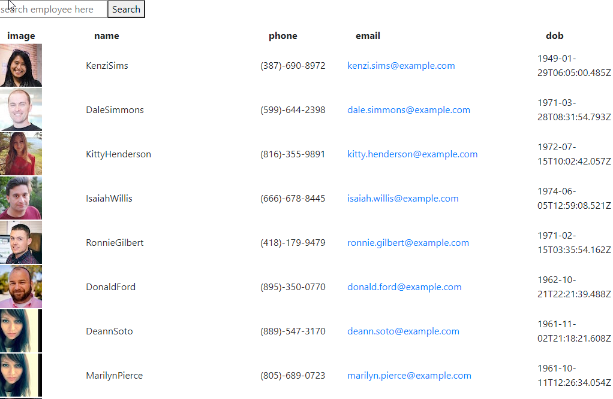

# employee-directory

this program uses react to create a responsive search function that sorts names alphabetically. It uses several components to simplify and section out the code to make it more readable. 

